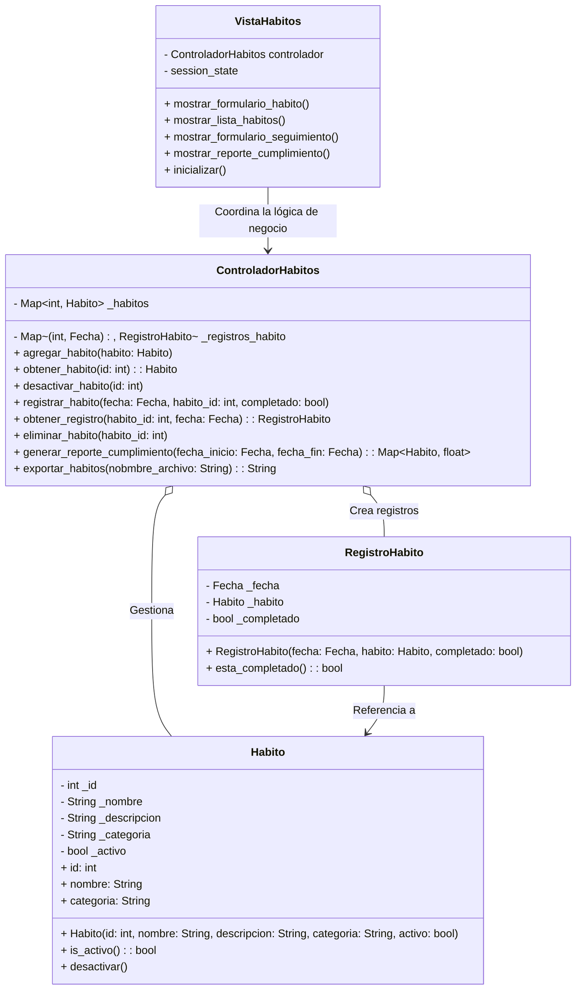

# Enunciado del proyecto

### Instalación del archivo requirements.txt

* Ejecutar el siguiente comando en consola ubicado en la carpeta raiz del proyecto
> Creación de ambiente virtual
> Activación de ambiente virtual
> ``pip install -r requirements.txt``

* Espere a que descarguen las dependencias. Esto puede tomar un tiempo. Si encuentra algún error revise la consola,
  busque en internet y corrija
* Corra su programa dando click derecho en el archivo run.py > "Run run.py"
* Si necesita correrlo en debug seleccione el mismo archivo pero corralo en modo debug
  > ``run.py > "Debug run"``

## Aplicación de Seguimiento de Hábitos

Esta aplicación permite gestionar y hacer seguimiento a hábitos diarios, registrando su cumplimiento en fechas específicas y facilitando el control de actividades en diferentes áreas de la vida.

### Historias de Usuario

#### Gestión de Hábitos

1. *Como usuario*, quiero **agregar un nuevo hábito** con su nombre, descripción y categoría, para poder hacer un seguimiento de mis actividades en diferentes áreas de mi vida.
2. Como usuario, quiero actualizar los detalles de un hábito existente para modificar la descripción o cambiar la categoría si lo considero necesario.
2. *Como usuario*, quiero **desactivar un hábito**, para que no se pueda registrar más su cumplimiento pero conserve su historial.
3. *Como usuario*, quiero **eliminar un hábito** si no tiene registros de cumplimiento, para mantener mi lista de hábitos organizada.
4. *Como usuario*, quiero **organizar mis hábitos en diferentes categorías** (como Salud, Productividad, Crecimiento personal, Social, Hogar) para mantener mis hábitos ordenados y más fáciles de identificar según mis objetivos personales.

#### Seguimiento Diario de Hábitos

1. *Como usuario*, quiero **registrar el cumplimiento de un hábito para una fecha específica**, para llevar un control diario de mis logros.
2. *Como usuario*, quiero **verificar si un hábito fue completado en una fecha específica**, para revisar mi progreso.

### Consulta de Progreso y Reportes de Cumplimiento

1. *Como usuario*, quiero **obtener un reporte de cumplimiento para mis hábitos en un periodo de tiempo específico** (por ejemplo, una semana o un mes) para ver el porcentaje de días que cumplí cada hábito y entender mejor mis patrones de seguimiento.
2. *Como usuario*, quiero **ver un resumen gráfico de mi progreso en el cumplimiento de mis hábitos**, para visualizar de manera rápida mis logros y las áreas en las que necesito mejorar.

#### Manejo de Excepciones

1. *Como usuario*, quiero **recibir un mensaje de error si intento registrar el cumplimiento de un hábito inactivo**, para entender por qué no puedo registrar su cumplimiento.
2. *Como usuario*, quiero **recibir un mensaje de error si intento eliminar un hábito con registros de cumplimiento asociados**, para saber que el hábito tiene historial que debe conservarse.

### Diagrama de Clases

## Actividades

## Familiariaridad con streamlit
1. Ejecute el proyecto. Abra el navegador y verifique que puede navegar entre todas las pestañas
2. Personalice el mensaje que sale en la opción "About"
3. Explorar los controles de streamlit.
    1. Agregue al menos dos controles de tipo "input widgets" en el archivo PruebaPage
    2. Intente organizar el contenido en dos columnas
    3. Pruebe el contenedor expander. Ponga texto dentro de este contenedor
    4. Haga una lista de chequeo. Defina el código para que según lo que según lo que seleccione se muestre un texto diferente
4. Funcionamiento de controles en la clase `MainView`
    1. En qué parte de ese archivo se dibuja la barra lateral.
    2. Observe el método `controlar_menu` del archivo MainView. ¿Para qué sirve la variable `self.menu_actual`?
5. Lea el texto que explica cómo funcionan las multipáginas https://docs.streamlit.io/develop/concepts/multipage-apps/pages-directory  Agregue una nueva página al directorio
6. En la nueva página que agregó  agregué tres diferentes tabs con textos diferentes. 

## Funciones especiales en python
* Investigue para qué sirve el método ``__str__``

